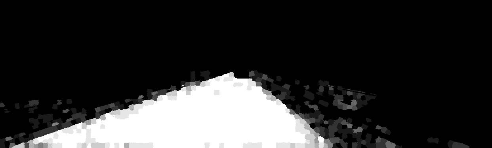

# road-estimation
Analyzing the effectiveness of various machine mearning algorithms in the segmentation/identification of roads within images from vehicle-mounted cameras.

We are making use of the [KITTI Vision Benchmark Suite](http://www.cvlibs.net/datasets/kitti/eval_road.php) to evaluate models.

###### Libraries used:
  * [scikit-learn](http://scikit-learn.org/)
  * [scikit-image](http://scikit-image.org/)
  * [NumPy](http://www.numpy.org/)
  * [SciPy](http://www.scipy.org/)
  * [matplotlib](http://matplotlib.org/)

###### Examples:
---
Original Photo:

Road Prediction - Brighter means higher predicted probability of being road:

Road Prediction Overlayed on Original Photo:

---
Original Photo:

Road Prediction - Brighter means higher predicted probability of being road:

Road Prediction Overlayed on Original Photo:

